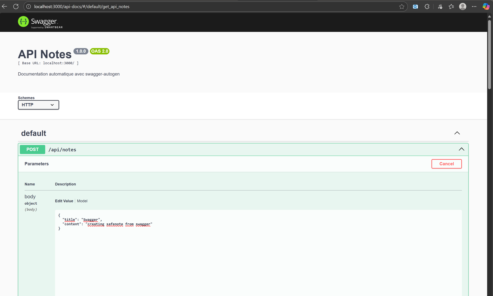

le test sur postman des endpoints

les données sont crypté dans la base de donné 


pour avoir de la documentation de swager il faut installer :
pour faire les commentaires manuellement pour définir les endpoints il faut installer
```
npm install swagger-jsdoc swagger-ui-express
```
pour une méthode semi-auto il nous permet de définir les endpoints en les accédant au requete au moins une seule fois 

```
npm install swagger-autogen swagger-ui-express
```
Avant de lancer ton app, tu fais une fois :
```
node swagger.js
```
and then boom 

