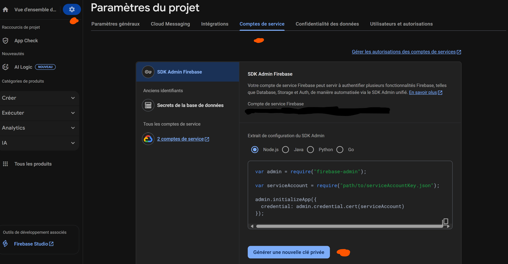
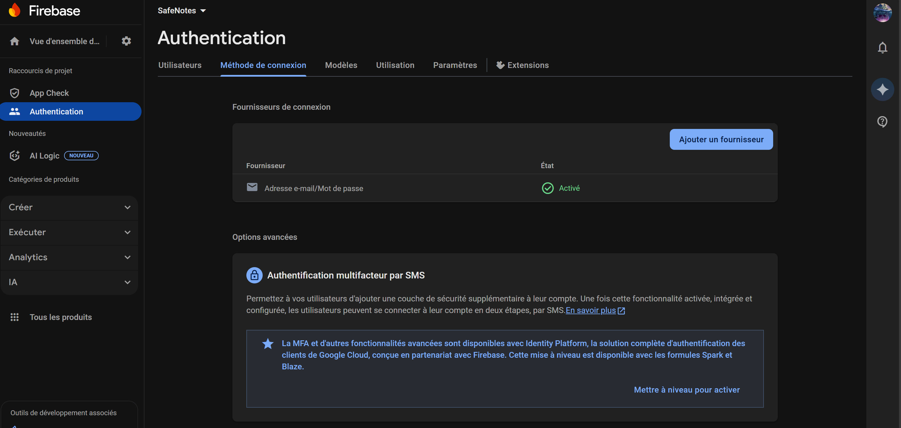

To obtain the private key for the Firebase Admin SDK, go to your Firebase project settings, then to the Service Accounts tab, and click on Generate new private key.

we need to allow the authentication with the email and password 
